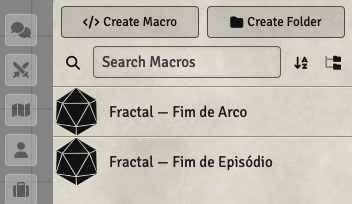

# Fractal RPG — Foundry VTT

> ⚠️ **Projeto NÃO-OFICIAL feito por fã para fã.**  
> Não é afiliado, endossado ou produzido pelos criadores do Fractal RPG.  
> Feito com amor para a comunidade, de graça e de código aberto.

Sistema para jogar **[Fractal RPG](https://fractal-system.itch.io/pt-br)** no [Foundry Virtual Tabletop](https://foundryvtt.com/) v13+.  
Baseado no SRD v1.0.1 de Igor Téuri & Walter Licínio (CC BY 4.0).

> 🎲 Conheça o canal **[Dados Críticos](https://www.youtube.com/@dadoscriticos)** no YouTube!

---

## Fichas de Personagem, Grupo e Desafio


Três tipos de ficha, cada uma com **cor de destaque própria** configurável pelo GM — facilitando identificar de imediato se você está olhando para um personagem, um grupo ou um desafio.

---

## Rolagens e Interlúdio


**Rolagem de Risco:** selecione até 3 Fatos para rolar, aplique Impulso e resolva os dados com um clique. O resultado aparece no chat com todos os detalhes — dados individuais, maior valor, Impulso utilizado e XP ganho.

**Interlúdio:** painel dedicado com as seis ações disponíveis entre sessões (Evoluir, Aprimorar, Descansar, Mudar, Preparar-se) e controle de XP integrado.

---

## Modal de Ruptura


Quando a rolagem gera Rupturas, o sistema pausa o chat e abre um modal pedindo ao jogador que **escolha quais Fatos romper** — exatamente como o sistema pede. Após a escolha, a mensagem no chat é atualizada com o resultado final.

---

## Reservas de Desafios e Grupo · Painel de Relógios


Desafios e Grupos têm **reservas customizadas** (nome, total, gatilho, consequência) que o GM pode fixar no **painel de relógios** da barra lateral direita. Os relógios exibem a cor de destaque do tipo de ator que os originou — verde para Grupos, marrom para Desafios — e permitem incrementar/decrementar sem abrir a ficha.

---

## Macros de XP



O sistema instala automaticamente duas macros prontas: **Fim de Episódio** e **Fim de Arco**, que distribuem XP para todos os personagens do mundo com base nas configurações de XP definidas pelo GM.

---

## Configurações do GM


Painel de configuração completo com quatro abas:

### Personagens / Desafios / Grupos
Cada aba tem seções independentes para:
- **Reservas** — nome, valor inicial, máximo, gatilho e consequência
- **Fatos Padrão** — tipos de fato que aparecem automaticamente em todas as fichas (ex: Ancestralidade, Classe), com flag de obrigatório
- **Cor de destaque** — accent color próprio para cada tipo de ficha, refletido no cabeçalho, bordas e no painel de relógios
- **Background** — imagem de fundo com controle de opacidade
- **Pré-configurações** — dropdown com presets prontos (Fantasia Medieval, Ficção Científica, Horror, Genérico), cada um com reservas, fatos, cores e CSS temáticos

### Aparência
- **CSS customizado** — injetado globalmente sobre todas as fichas, com variáveis `:root` documentadas e botão para carregar o CSS padrão

---

## ✅ Funcionalidades completas

### Ficha de Personagem
- **Fatos** — criação, edição e remoção inline; selecionar até 3 para rolar; romper/restaurar; Fatos Padrão definidos pelo GM aparecem como slots fixos com label do tipo
- **Reservas** — configuradas pelo GM por mundo, tracker de bubbles clicável, total ajustável por ficha
- **Rolagem de Risco** — selecione Fatos, role d6s, escolha Impulso e resolva Rupturas com modal interativo
- **Interlúdio** — seis ações com custo de XP e confirmação
- **Avatar** — clique na imagem para trocar ou fazer upload de uma nova foto

### Ficha de Desafio
- **Reservas de mundo** + **reservas customizadas** por desafio, ambas com pin para o painel de relógios
- **Fatos** com toggle de ruptura — badge **SUPERADO** quando todos estão rompidos
- **Notas do Arquiteto** visíveis apenas para GM/dono

### Ficha de Grupo
- **Reservas customizadas** com pin para o painel de relógios
- **Fatos** com Fatos Padrão configuráveis pelo GM
- **Notas** livres

### Painel de Relógios (HUD)
- Reservas pinnadas de Desafios e Grupos aparecem na barra lateral direita
- Cor do relógio reflete o accent do tipo de ator de origem
- Incrementar/decrementar sem abrir a ficha; GM pode despinnar

### Configurações do GM
- Presets externos (JSON) com reservas, fatos, cores e CSS por tipo de ficha
- Fatos Padrão por tipo: slots que aparecem automaticamente em todas as fichas do tipo
- Cor de destaque independente para Personagem, Desafio e Grupo
- Background com opacidade independente por tipo
- CSS customizado global com variáveis de tema documentadas
- Macros de XP (Fim de Episódio / Fim de Arco) instaladas automaticamente

---

## 📦 Instalação

1. Abra o Foundry VTT
2. Vá em **Configurações → Gerenciar Sistemas → Instalar Sistema**
3. Cole no campo _Manifest URL_:
```
https://github.com/SergioSJS/fractal-rpg-fvtt/releases/latest/download/system.json
```
4. Clique em **Instalar**

---

## 💻 Desenvolvimento Local (Symlink)

```bash
git clone https://github.com/SergioSJS/fractal-rpg-fvtt.git

# Mac/Linux
ln -s "$(pwd)/fractal-rpg-fvtt" "$HOME/Library/Application Support/FoundryVTT/Data/systems/fractal-rpg"

# Windows (CMD como Administrador)
mklink /D "%APPDATA%\FoundryVTT\Data\systems\fractal-rpg" "C:\Caminho\Para\fractal-rpg-fvtt"
```

Reinicie o Foundry e o sistema aparecerá na lista.

---

## 🚀 Publicando uma Nova Versão

O projeto usa GitHub Actions para gerar releases automaticamente.  
Basta criar e enviar uma tag semântica:

```bash
git tag v0.3.0
git push origin v0.3.0
```

O CI irá:
1. Atualizar `system.json` com a nova versão e URL de download
2. Empacotar `fractal-rpg.zip` com todos os arquivos do sistema
3. Criar o GitHub Release com o zip e o `system.json` como artefatos

---

## Compatibilidade

| Foundry VTT | Status |
|-------------|--------|
| v13         | ✅ Suportado |
| v14         | ✅ Verificado |

---

## 📋 Licença e Créditos

- O código deste repositório está sob [MIT License](LICENSE).
- Sistema **[Fractal RPG](https://fractal-system.itch.io/pt-br)** criado por Igor Téuri & Walter Licínio — todo o conteúdo narrativo e de regras pertence a eles (CC BY 4.0).
- Canal **[Dados Críticos](https://www.youtube.com/@dadoscriticos)** — onde o sistema é usado e divulgado.
- Feito por **Sérgio Sousa** — [meioorc.com](https://meioorc.com)
